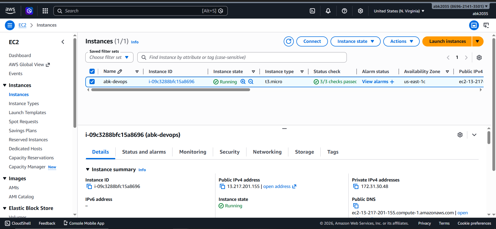
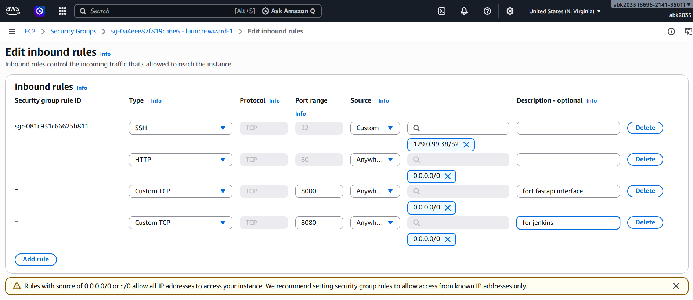

# Rapport de Projet DevOps : Pipeline CI/CD automatisé pour une application FastAPI sur AWS

**Auteur :** Arnold Borele  
**Date :** 14 Avril 2026

---

## 📑 Table des matières
1. [Présentation du Projet](#présentation-du-projet)
2. [Architecture Technique](#architecture-technique)
3. [Étape 1 : Préparation de l'instance AWS EC2](#3-step-1-aws-ec2-instance-preparation)
4. [Étape 2 : Installer les dépendances sur EC2](#4-step-2-install-dependencies-on-ec2)
5. [Étape 3 : Installation et configuration de Jenkins](#5-step-3-jenkins-installation-and-setup)
6. [Étape 4 : Configuration du dépôt GitHub](#6-step-4-github-repository-configuration)
    * [Dockerfile](#dockerfile)
    * [docker-compose.yml](#docker-composeyml)
    * [Jenkinsfile](#jenkinsfile)
7. [Étape 5 : Création et exécution d'un pipeline Jenkins](#7-étape-5-création-et-exécution-d'un-pipeline-Jenkins)
8. [Conclusion](#8-conclusion)
9. [Conclusion](#conclusion)

---

## 1. Présentation du Projet
Ce document décrit étape par étape la procédure de déploiement d'une application web (FastApi + PostgresSQL) sur une instance AWS EC2. Le déploiement est conteneurisé à l'aide de Docker et de Docker Compose. Un pipeline CI/CD complet est mis en place à l'aide de Jenkins afin d'automatiser les processus de compilation et de déploiement chaque fois qu'un nouveau code est poussé vers un dépôt GitHub.

---
## 2. Architecture Technique

```
+-----------------+      +----------------------+      +-----------------------------+
|    Développeur  |----->|   Dépôt GitHub       |----->|      Serveur Jenkins        |
|  (push du code) |      | (Gestion de source)  |      |       (sur AWS EC2)         |
+-----------------+      +----------------------+      |                             |
                                                       | 1. Clone le dépôt           |
                                                       | 2. Construit l'image Docker |
                                                       | 3. Lance Docker Compose     |
                                                       +--------------+--------------+
                                                                      |
                                                                      | Déploie
                                                                      v
                                                       +-----------------------------+
                                                       |    Serveur d'Application    |
                                                       |       (Même EC2 AWS)        |
                                                       |                             |
                                                       | +-------------------------+ |
                                                       | | Conteneur : FastAPI     | |
                                                       | +-------------------------+ |
                                                       |               |             |
                                                       |               v             |
                                                       | +-------------------------+ |
                                                       | | Conteneur : PostgreSQL  | |
                                                       | +-------------------------+ |
                                                       +-----------------------------+

```
---
## 3. Étape 1 : Préparation de l'instance AWS EC2

1.  **Lancer une instance EC2 :**
    * Accédez à la console AWS EC2.
    * Lancez une nouvelle instance à l'aide de l'AMI **Ubuntu 24...LTS**.
    * Sélectionnez le type d'instance **t3.micro** pour bénéficier de l'offre gratuite.
    * Créez et attribuez une nouvelle paire de clés pour l'accès SSH.
      


2.  **Configurer le groupe de sécurité :**
    * Créez un groupe de sécurité avec les règles entrantes (inbound rules) suivantes :
        * **Type :** SSH, **Protocole :** TCP, **Port :** 22, **Source :** Votre adresse IP
        * **Type :** HTTP, **Protocole :** TCP, **Port :** 80, **Source :** N'importe où (0.0.0.0/0)
        * **Type :** TCP personnalisé, **Protocole :** TCP, **Port :** 5000 (pour FastApi), **Source :** N'importe où (0.0.0.0/0)
        * **Type :** TCP personnalisé, **Protocole :** TCP, **Port :** 8080 (pour Jenkins), **Source :** N'importe où (0.0.0.0/0)



3.  **Se connecter à l'instance EC2 :**
    * Utilisez SSH pour vous connecter à l'adresse IP publique de l'instance.
    ```bash
    ssh -i /chemin/vers/clé.pem ubuntu@<ec2-ip-publique>
    ```
---

## 4. Étape 2 : Installer les dépendances sur EC2

1.  **Mise à jour des paquets système :**
    ```bash
    sudo apt update && sudo apt upgrade -y
    ```
2.  **Installer Git, Docker et Docker Compose :**
    ```bash
    sudo apt install git docker.io docker-compose-v2 -y
    ```
3.  **Démarrer et activer Docker :**
    ```bash
    sudo systemctl start docker
    sudo systemctl enable docker
    ```
4.  **Ajouter un utilisateur au groupe Docker (pour exécuter Docker sans sudo) :**
    ```bash
    sudo usermod -aG docker $USER
    newgrp docker
    ```

---

## 5. Étape 3 : Installation et configuration de Jenkins

1.  **Installer Java (OpenJDK 17) :**
    ```bash
    sudo apt install openjdk-17-jdk -y
    ```

2.  **Ajouter le référentiel Jenkins et procéder à l'installation :**
    ```bash
     sudo wget -O /etc/apt/keyrings/jenkins-keyring.asc \
      https://pkg.jenkins.io/debian-stable/jenkins.io-2026.key
     echo "deb [signed-by=/etc/apt/keyrings/jenkins-keyring.asc]" \
      https://pkg.jenkins.io/debian-stable binary/ | sudo tee \
      /etc/apt/sources.list.d/jenkins.list > /dev/null
     sudo apt update
     sudo apt install jenkins
    ```
    
3.  **Démarrer et activer le service Jenkins :**
    ```bash
    sudo systemctl start jenkins
    sudo systemctl enable jenkins
    ```
    
4.  **Configuration initiale de Jenkins :**
    * Récupérez le mot de passe administrateur initial :
        ```bash
        sudo cat /var/lib/jenkins/secrets/initialAdminPassword
        ```
    * Accédez au tableau de bord de Jenkins à l'adresse `http://<ec2-public-ip>:8080`.
    * Collez le mot de passe, installez les plugins suggérés et créez un utilisateur administrateur.

5.  **Accorder les autorisations Docker à Jenkins :**
    ```bash
    sudo usermod -aG docker jenkins
    sudo systemctl restart jenkins
    ```
    
    

---

